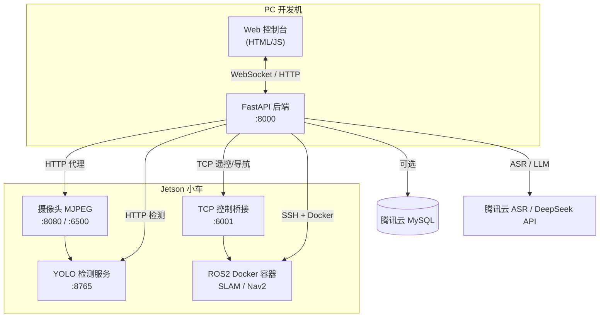
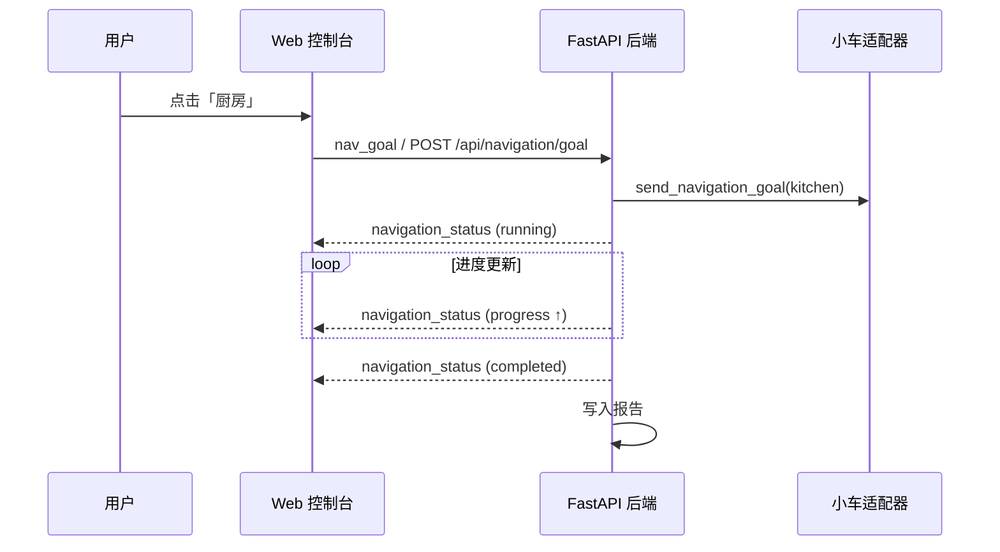
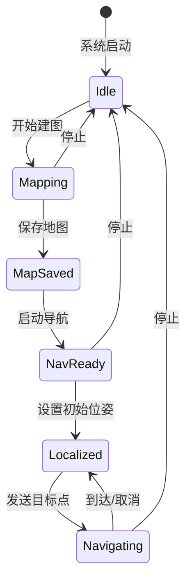
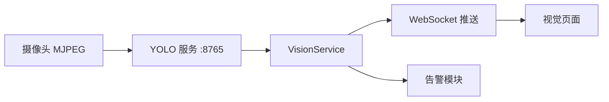
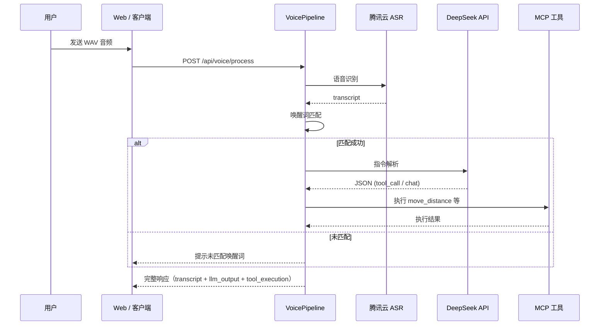
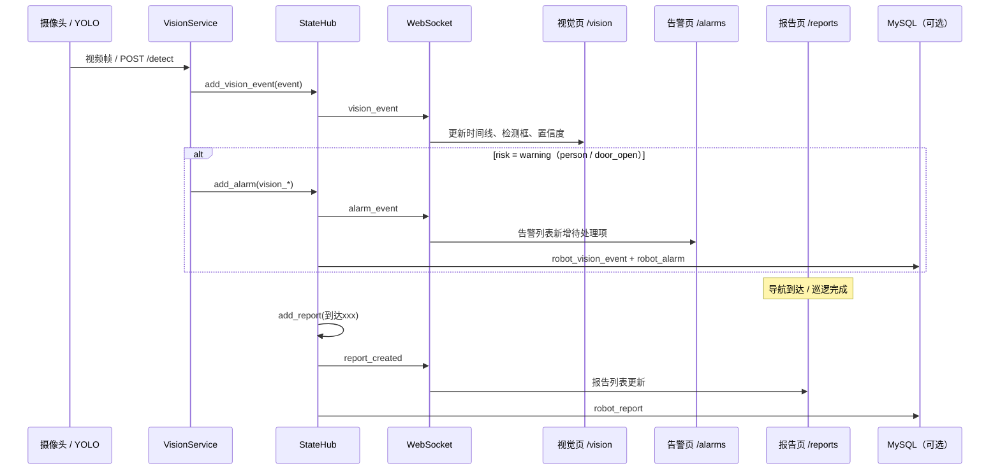
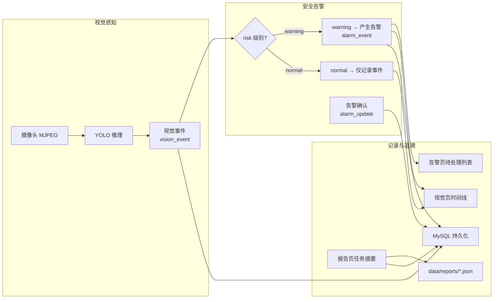

# 智能家居管家机器人 Web 控制系统 — 需求规格说明书

| 项目 | 内容 |
| --- | --- |
| 文档版本 | v1.0 |
| 项目名称 | 智能家居管家机器人 Web 控制系统 |
| 文档类型 | 课程实训答辩交付物（现状描述） |
| 编写日期 | 2026-07-13 |
| 目标读者 | 课程评审老师、项目开发组员 |
| 运行环境 | 真车联调（Jetson + ROS2 Foxy + Yahboom 小车） |

---

## 1. 文档说明

### 1.1 编写目的

本文档用于课程实训答辩，描述**当前已实现**的系统功能、运行环境、接口约定与验收标准，供评审老师了解系统能力边界，供开发组员对齐分工与交付范围。

### 1.2 范围说明

- **在范围内**：Web 上位机、后端桥接服务、导航/SLAM/视觉/传感器/语音等已实现模块，以及真车部署与联调流程。
- **不在范围内**：尚未实现或未联调的功能规划、商业产品运营需求。

### 1.3 术语与缩写

| 术语 | 说明 |
| --- | --- |
| Web 上位机 | 浏览器访问的 HTML/CSS/JS 控制台 |
| 适配器 | 后端与小车通信的抽象层（simulated / tcp / ros2_cli） |
| SLAM | 同步定位与建图 |
| Nav2 | ROS2 导航框架 |
| YOLO | 目标检测模型，本项目使用 YOLOv5 |
| MCP 工具 | 供 LLM 调用的结构化机器人动作接口 |

---

## 2. 项目背景与目标

### 2.1 背景

本项目面向「智能家居管家机器人」实训场景：通过 Web 控制台远程管理移动机器人，完成家庭环境下的巡逻、环境监测、视觉安防与语音交互等任务。系统采用前后端分离但轻量部署的结构，后端基于 Python FastAPI，前端为原生 HTML，便于在 Windows 开发机与 Jetson 小车侧快速演示。

### 2.2 建设目标

1. 提供统一的 Web 控制台，支持真车遥控、导航、SLAM、视觉、传感器与告警管理。
2. 通过 TCP/ROS2 适配器对接 Yahboom 小车，实现 PC 端控制与 Jetson 端感知推理分离部署。
3. 支持 SLAM 建图、地图保存、Nav2 自动导航的完整实车流程。
4. 集成 YOLO 视觉检测与传感器阈值告警，形成「感知—告警—报告」闭环。
5. 支持语音唤醒 + ASR + LLM 指令解析，驱动机器人工具调用（如按距离前进）。

### 2.3 用户角色

| 角色 | 描述 | 主要诉求 |
| --- | --- | --- |
| 评审老师 | 课程答辩与验收 | 快速理解系统架构、演示路径、功能完成度 |
| 项目组员 | 分工开发与联调 | 明确模块边界、接口约定、验收标准 |

---

## 3. 系统架构

### 3.1 总体架构（分层软件架构）

```mermaid
flowchart TB
    TITLE["智能家居管家机器人 Web 控制系统软件架构"]

    subgraph L0["接入层"]
        direction LR
        UI1["总览 / 遥控页"]
        UI2["SLAM 导航页"]
        UI3["视觉 / 告警 / 报告页"]
        UI4["WebSocket 客户端"]
    end

    subgraph L1["业务服务层"]
        direction LR
        S1["手动遥控服务"]
        S2["家庭导航服务"]
        S3["SLAM 建图导航服务"]
        S4["视觉检测服务"]
        S5["传感器监测服务"]
        S6["语音交互服务"]
    end

    subgraph L2["基础服务层"]
        direction LR
        B1["导航任务服务"]
        B2["告警管理服务"]
        B3["报告记录服务"]
        B4["状态汇总服务"]
        B5["MCP 工具服务"]
        B6["摄像头代理服务"]
    end

    subgraph L3["通用逻辑层"]
        direction TB
        subgraph L3A["管理类"]
            direction LR
            M1["导航状态机"]
            M2["SLAM 运行时管理"]
            M3["传感器阈值管理"]
            M4["视觉事件管理"]
            M5["适配器工厂"]
        end
        subgraph L3B["策略类"]
            direction LR
            P1["小车适配策略<br/>simulated / tcp / ros2_cli"]
            P2["视觉模式策略<br/>simulated / auto / remote"]
            P3["告警级别策略"]
            P4["语音指令解析策略"]
        end
    end

    subgraph L4["数据层"]
        direction LR
        D1["点位 / 路线配置"]
        D2["告警 / 报告 DAO"]
        D3["视觉事件数据"]
        D4["传感器采样数据"]
        D5["SLAM 地图缓存"]
    end

    subgraph L5["存储库"]
        direction LR
        ST1[("config<br/>points / routes")]
        ST2[("data/reports<br/>data/captures")]
        ST3[("data/slam_maps")]
        ST4[("MySQL<br/>可选持久化")]
    end

    subgraph L6["依赖服务"]
        direction LR
        E1["Jetson TCP 桥接<br/>:6001"]
        E2["摄像头 MJPEG<br/>:6500 / :8080"]
        E3["YOLO 检测服务<br/>:8765"]
        E4["ROS2 Nav2 导航栈"]
        E5["腾讯云 ASR"]
        E6["DeepSeek LLM API"]
    end

    subgraph L7["中间件"]
        direction LR
        MW1["FastAPI + WebSocket"]
        MW2["SSH / Docker Exec"]
        MW3["HTTP Client / 代理"]
        MW4["TCP Socket"]
        MW5["asyncio 任务调度"]
    end

    subgraph CC["横切能力"]
        direction TB
        CC1["日志切面"]
        CC2["业务监控<br/>导航 / 视觉 / 告警"]
        CC3["系统监控<br/>连接 / 端口 / 容器"]
    end

    TITLE --> L0
    L0 --> L1
    L1 --> L2
    L2 --> L3
    L3 --> L4
    L4 --> L5
    L5 --> L6
    L6 --> L7

    L1 -.-> CC
    L2 -.-> CC
    L3 -.-> CC
    L4 -.-> CC
    L5 -.-> CC

    classDef titleStyle fill:#ECEFF1,stroke:#455A64,stroke-width:2px,color:#263238
    classDef layer0 fill:#E3F2FD,stroke:#1E88E5,stroke-width:2px
    classDef layer1 fill:#FFF9C4,stroke:#F9A825,stroke-width:2px
    classDef layer2 fill:#FCE4EC,stroke:#EC407A,stroke-width:2px
    classDef layer3 fill:#DCEDC8,stroke:#7CB342,stroke-width:2px
    classDef layer4 fill:#FFE0B2,stroke:#FB8C00,stroke-width:2px
    classDef layer5 fill:#B3E5FC,stroke:#039BE5,stroke-width:2px
    classDef layer6 fill:#F8BBD0,stroke:#D81B60,stroke-width:2px
    classDef layer7 fill:#81D4FA,stroke:#0277BD,stroke-width:2px
    classDef crossCut fill:#FFCC80,stroke:#EF6C00,stroke-width:2px

    class TITLE titleStyle
    class L0,UI1,UI2,UI3,UI4 layer0
    class L1,S1,S2,S3,S4,S5,S6 layer1
    class L2,B1,B2,B3,B4,B5,B6 layer2
    class L3,L3A,L3B,M1,M2,M3,M4,M5,P1,P2,P3,P4 layer3
    class L4,D1,D2,D3,D4,D5 layer4
    class L5,ST1,ST2,ST3,ST4 layer5
    class L6,E1,E2,E3,E4,E5,E6 layer6
    class L7,MW1,MW2,MW3,MW4,MW5 layer7
    class CC,CC1,CC2,CC3 crossCut
```

**分层说明**

| 层次 | 职责 | 本项目对应 |
| --- | --- | --- |
| 接入层 | Web 页面与实时通信 | `frontend/` 各 HTML 页 + WebSocket |
| 业务服务层 | 面向用户的业务能力 | 遥控、导航、SLAM、视觉、传感器、语音 |
| 基础服务层 | 核心业务编排 | `NavigationService`、`StateHub`、`VisionService` 等 |
| 通用逻辑层 | 状态机、策略与适配 | 适配器工厂、SLAM 管理、阈值/告警策略 |
| 数据层 | 配置与运行时数据访问 | JSON 配置、内存状态、DB 读写 |
| 存储库 | 持久化介质 | 本地文件、可选 MySQL |
| 依赖服务 | 外部/边缘侧服务 | Jetson 桥接、YOLO、ROS2、云 API |
| 中间件 | 通信与运行时基础设施 | FastAPI、SSH、HTTP、TCP、asyncio |
| 横切能力 | 贯穿各层的公共能力 | 日志、业务/系统监控 |

### 3.2 部署拓扑（真车默认）

**部署说明**

| 组件 | 默认地址/端口 | 说明 |
| --- | --- | --- |
| Web 后端 | PC `0.0.0.0:8000` | FastAPI + 静态前端 |
| 控制桥接 | Jetson `:6001` | Rosmaster TCP 桥接 |
| 摄像头流 | Jetson `:6500` / `:8080` | MJPEG 实时画面 |
| YOLO 服务 | Jetson `:8765` | 远程检测 HTTP 接口 |
| ROS2 容器 | Jetson Docker | SLAM 建图与 Nav2 导航 |
| 小车 IP | 如 `192.168.137.173` | 热点/局域网内可达 |

### 3.3 技术选型

| 层次 | 技术 | 选型理由 |
| --- | --- | --- |
| 后端 | Python + FastAPI + WebSocket | 与 ROS2/YOLO/Jetson 生态衔接紧密 |
| 前端 | 原生 HTML/CSS/JS | 免 Node 构建，跨平台快速演示 |
| 小车通信 | TCP 适配器（主）/ ROS2 CLI（备） | 对接鸿蒙 APP 协议与 Nav2 话题 |
| 视觉 | YOLOv5 + HTTP 事件服务 | Jetson 侧推理，Web 侧展示与告警 |
| 语音 | 腾讯云 ASR + DeepSeek LLM | 唤醒词 + 指令解析 + 工具调用 |
| 持久化 | 腾讯云 MySQL（可选） | 告警、报告、视觉事件、传感器采样 |

---

## 4. 功能需求

### 4.1 功能总览

| 编号 | 模块 | 优先级 | 状态 | 说明 |
| --- | --- | --- | --- | --- |
| FR-01 | 连接与状态 | P0 | 已实现 | WebSocket 实时推送、连接状态、快照 |
| FR-02 | 手动遥控/急停 | P1 | 已实现 | 简要能力，非答辩重点 |
| FR-03 | 家庭导航 | P0 | 已实现 | 单点导航、巡逻路线 |
| FR-04 | SLAM 建图与导航 | P0 | 已实现 | 真车完整流程 |
| FR-05 | 视觉检测 | P0 | 已实现 | YOLO 远程检测 + 告警 |
| FR-06 | 传感器与告警 | P0 | 已实现 | 五类传感器 + 阈值告警 |
| FR-07 | 语音交互 | P0 | 已实现 | 唤醒 + ASR + LLM + 工具执行 |
| FR-08 | 报告记录 | P1 | 已实现 | 导航/巡逻/告警事件报告 |
| FR-09 | 数据库持久化 | P2 | 可选 | 环境变量启用 MySQL |

---

### 4.2 FR-02 手动遥控与急停（简要）

> 本模块作为基础能力保留，答辩演示以导航、SLAM、视觉、传感器、语音为主。

| 需求 ID | 描述 | 验收标准 |
| --- | --- | --- |
| FR-02-01 | Web 控制台提供前进/后退/左转/右转/停止按钮 | 点击后小车状态更新，TCP 模式下真车响应 |
| FR-02-02 | 支持速度档位调节与脉冲式控制 | 松手后自动停车，避免持续冲撞 |
| FR-02-03 | 急停按钮 | 模式变为急停，产生 danger 级告警 |
| FR-02-04 | 适配器切换 | 支持 simulated / tcp / ros2_cli 三种模式 |

---

### 4.3 FR-03 家庭导航

#### 4.3.1 功能描述

基于预配置的家庭点位（`config/points.json`）与巡逻路线（`config/routes.json`），用户可通过 Web 控制台发起单点导航或顺序巡逻。后端通过适配器向小车发送导航目标，并以 WebSocket 推送导航进度。

#### 4.3.2 预置数据

**家庭点位（5 个）**

| ID | 名称 | 类型 | 用途 |
| --- | --- | --- | --- |
| living_room | 客厅 | room | 演示起点与主巡逻区 |
| kitchen | 厨房 | room | 燃气/PM2.5 重点检测 |
| bedroom | 卧室 | room | 温湿度看护 |
| corridor | 走廊 | passage | 夜间巡逻 |
| door | 门口 | security | 安防巡逻 |

**巡逻路线（2 条）**

| ID | 名称 | 途经点位 |
| --- | --- | --- |
| night_watch | 夜间警卫 | 客厅 → 走廊 → 门口 → 厨房 |
| air_quality | 全屋空气采集 | 客厅 → 卧室 → 厨房 |

#### 4.3.3 功能需求明细

| 需求 ID | 描述 | 验收标准 |
| --- | --- | --- |
| FR-03-01 | 单点导航 | 选择点位后导航状态变为 running，进度递增，到达后 state=completed |
| FR-03-02 | 巡逻路线 | 按路线顺序逐点执行，完成后产生巡逻报告 |
| FR-03-03 | 停止导航 | 调用停止接口后任务终止，小车 standby |
| FR-03-04 | 状态推送 | WebSocket 推送 navigation_status，含 task_id、target、progress、message |
| FR-03-05 | 真车对接 | TCP/ROS2 模式下 adapter.send_navigation_goal 向小车发布目标 |

#### 4.3.4 导航流程

---

### 4.4 FR-04 SLAM 建图与自动导航

#### 4.4.1 功能描述

通过 Web 导航页（`/navigation`）驱动 Jetson 上 ROS2 Docker 容器完成 SLAM 建图、地图保存、Nav2 导航启动、初始位姿设置与目标点发送。后端 `SlamRuntimeManager` 经 SSH 管理容器内 gmapping/cartographer/rtabmap 与 DWA/TEB/Nav2 进程。

#### 4.4.2 实车标准流程

| 步骤 | 操作 | 预期结果 |
| --- | --- | --- |
| 1 | 检查连接 | SSH、6001、6500、ROS2 容器状态可见 |
| 2 | 开始建图 | 启动 gmapping，遥控慢速移动小车 |
| 3 | 保存地图 | 生成 `.yaml/.pgm`，供后续导航加载 |
| 4 | 启动导航 | 加载地图，启动 DWA/TEB/RTABMap 导航 |
| 5 | 确认当前位置 | 地图点选后发布 `/initialpose`，AMCL 定位 |
| 6 | 去目标点 | 地图点选后发布 `/goal_pose`，小车自动导航 |

#### 4.4.3 功能需求明细

| 需求 ID | 描述 | 验收标准 |
| --- | --- | --- |
| FR-04-01 | SLAM 状态查询 | GET `/api/slam/status` 返回 SSH、容器、话题、Nav2 就绪状态 |
| FR-04-02 | 开始建图 | POST `/api/slam/mapping/start`，支持 gmapping 等算法 |
| FR-04-03 | 保存地图 | POST `/api/slam/map/save`，地图缓存至 `data/slam_maps/` |
| FR-04-04 | 启动导航 | POST `/api/slam/navigation/start`，Nav2 ready 后返回 ok |
| FR-04-05 | 设置初始位姿 | POST `/api/slam/pose/initial`，发布 initialpose |
| FR-04-06 | 查询当前位姿 | GET `/api/slam/pose/current`，AMCL 回传位姿 |
| FR-04-07 | 发送导航目标 | POST `/api/slam/goal`，支持 require_localized 校验 |
| FR-04-08 | 地图可视化 | Web 端 Canvas 展示地图，支持点选起点/目标点 |
| FR-04-09 | 建图遥控 | 导航页内置慢速 D-Pad，建图时手动移动小车 |
| FR-04-10 | 停止 SLAM/导航 | POST `/api/slam/stop`，终止相关进程 |

#### 4.4.4 SLAM 状态机

---

### 4.5 FR-05 视觉检测（YOLO）

#### 4.5.1 功能描述

视觉模块支持三种模式（`vision.mode`）：`simulated`（本地模拟）、`auto`（优先远程 YOLO，失败回退模拟）、`remote`（仅远程）。真车环境下，Jetson 运行 YOLOv5 HTTP 服务（默认 `:8765`），后端拉取摄像头流并调用 `/detect` 获取检测结果。

#### 4.5.2 检测目标

| 目标 ID | 中文标签 | 风险等级 |
| --- | --- | --- |
| person | 人员 | warning |
| cat / dog | 宠物 | normal |
| door_open | 门窗未关闭 | warning |
| clear | 未发现异常 | normal |

#### 4.5.3 功能需求明细

| 需求 ID | 描述 | 验收标准 |
| --- | --- | --- |
| FR-05-01 | 单次检测 | POST `/api/vision/detect`，返回 label、confidence、bbox |
| FR-05-02 | 持续检测 | POST `/api/vision/start` 启动后台轮询，POST `/api/vision/stop` 停止 |
| FR-05-03 | 状态查询 | GET `/api/vision/status` 返回 running、targets、stream_url、service_url |
| FR-05-04 | 摄像头流 | 支持 `:6500` / `:8080` MJPEG，后端可代理 `/api/camera/stream` |
| FR-05-05 | 告警联动 | warning 级检测自动产生 vision_* 告警 |
| FR-05-06 | 真车 YOLO | remote/auto 模式下调用 Jetson `:8765/detect`，返回真实推理结果 |

#### 4.5.4 视觉数据流

---

### 4.6 FR-06 传感器与告警

#### 4.6.1 功能描述

传感器服务周期性生成/刷新五类环境数据，根据阈值判定 normal/warning/danger 级别，超阈值时自动产生告警。Web 控制台实时展示传感器面板，用户可确认告警。

#### 4.6.2 传感器类型与阈值

| 传感器 | 单位 | warning | danger |
| --- | --- | --- | --- |
| temperature（温度） | ℃ | ≥30 | ≥36 |
| humidity（湿度） | % | ≥70 | ≥82 |
| light（光照） | lux | ≤90（偏低） | ≤40（偏低） |
| gas（可燃气体） | — | ≥0.35 | ≥0.65 |
| pm25（PM2.5） | μg/m³ | ≥75 | ≥115 |

#### 4.6.3 功能需求明细

| 需求 ID | 描述 | 验收标准 |
| --- | --- | --- |
| FR-06-01 | 传感器刷新 | 默认每 1.5s 更新，WebSocket 推送 sensor_update |
| FR-06-02 | 级别判定 | 每项传感器显示 normal/warning/danger |
| FR-06-03 | 阈值告警 | 超阈值产生 sensor_* 告警，恢复正常后不再重复告警 |
| FR-06-04 | 告警列表 | 告警页展示类型、级别、时间、来源、消息 |
| FR-06-05 | 告警确认 | POST `/api/alarms/{id}/confirm`，记录 operator |
| FR-06-06 | 连接告警 | 小车连接失败时产生 connection 告警 |
| FR-06-07 | 急停告警 | 急停触发 emergency_stop danger 告警 |

#### 4.6.4 告警来源

| 来源 | 触发条件 |
| --- | --- |
| sensor | 传感器超阈值 |
| vision | 视觉检测到 warning 级目标 |
| navigation | 急停 |
| backend | 连接失败、SLAM 失败、语音失败等 |
| voice | 语音处理异常 |

---

### 4.7 FR-07 语音交互

#### 4.7.1 功能描述

语音流水线：`音频输入 → 腾讯云 ASR 识别 → 唤醒词匹配 → LLM 指令解析 → MCP 工具执行`。默认唤醒词为「小比」，LLM 可将自然语言映射为结构化工具调用（如 `move_distance`）。

#### 4.7.2 处理流程

#### 4.7.3 功能需求明细

| 需求 ID | 描述 | 验收标准 |
| --- | --- | --- |
| FR-07-01 | 语音识别 | 支持 WAV 等格式，调用腾讯云 SentenceRecognition |
| FR-07-02 | 唤醒词 | 默认「小比」，可通过环境变量配置多个唤醒词 |
| FR-07-03 | 指令解析 | LLM 返回 JSON：`intent=tool_call` 或 `intent=chat` |
| FR-07-04 | 工具执行 | 支持 `move_distance(direction, meters)`，固定速度 0.2 m/s |
| FR-07-05 | 健康检查 | GET `/api/voice/health` 返回 ASR/LLM 配置状态 |
| FR-07-06 | 失败告警 | 语音处理异常产生 voice 告警 |

#### 4.7.4 环境变量（关键）

| 变量 | 说明 |
| --- | --- |
| TENCENT_SECRET_ID / TENCENT_SECRET_KEY | 腾讯云 ASR 凭证 |
| OPENAI_API_KEY / OPENAI_BASE_URL / OPENAI_MODEL | LLM 配置（默认 DeepSeek） |
| VOICE_WAKE_PHRASES | 唤醒词列表 |

---

### 4.8 FR-08 报告记录

| 需求 ID | 描述 | 验收标准 |
| --- | --- | --- |
| FR-08-01 | 导航到达报告 | 单点导航完成后写入报告列表 |
| FR-08-02 | 巡逻完成报告 | 巡逻路线执行完毕后写入报告 |
| FR-08-03 | 报告查询 | GET `/api/reports` 返回历史记录 |
| FR-08-04 | 可选持久化 | 启用 MySQL 后报告写入 `robot_report` 表 |
| FR-08-05 | 本地文件归档 | 每条报告另存为 `data/reports/{report_id}.json` |

---

### 4.9 视觉告警报告（一体化说明）

本节将**视觉检测、告警中心、报告记录**三条链路合并说明，便于答辩演示「感知 → 告警 → 追溯」闭环。

#### 4.9.1 业务场景

机器人在家庭环境中巡逻或定点值守时，通过摄像头 + YOLO 识别人员、宠物、门窗异常等目标。当检测到 **warning** 级目标（如人员、门窗未关闭）时，系统自动推送视觉事件并产生告警；运维人员可在告警中心确认处理。导航/巡逻任务完成后，报告页记录任务摘要；视觉事件本身独立存档，可通过视觉页时间线与数据库追溯。

#### 4.9.2 端到端流程

#### 4.9.3 三类数据对象

**① 视觉事件（Vision Event）**

| 字段 | 说明 | 示例 |
| --- | --- | --- |
| id | 事件 ID | `vis-a1b2c3d4` |
| timestamp | 检测时间 | `2026-07-13 22:00:01` |
| label / label_zh | 目标类别 | `person` / `人员` |
| confidence | 置信度 | `0.87` |
| risk | 风险等级 | `warning` / `normal` |
| bbox | 检测框 | `[120, 80, 260, 360]` |
| image_url | 截图或占位图 | 检测画面 URL |
| source | 数据来源 | `remote_yolo_stream` / `camera_stream` |
| stream_url | 视频流地址 | `http://{car}:6500/video_feed` |

**② 告警（Alarm）**

| 字段 | 说明 | 示例 |
| --- | --- | --- |
| alarm_id | 告警 ID | `alm-x9y8z7w6` |
| type | 告警类型 | `vision_person` / `vision_door_open` |
| level | 级别 | `warning` |
| message | 提示文案 | `视觉检测到人员，请确认家庭环境。` |
| source | 来源 | `vision` |
| status | 状态 | `open` → `confirmed` |
| metadata | 关联视觉事件 | 含 label、bbox、confidence 等 |

**③ 报告（Report）**

| 字段 | 说明 | 示例 |
| --- | --- | --- |
| report_id | 报告 ID | `rep-m5n6o7p8` |
| title | 标题 | `到达厨房` |
| summary | 摘要 | `机器人已到达厨房，完成一次点位任务。` |
| details | 详情 JSON | 含 navigation、sensors 等 |
| timestamp | 生成时间 | `2026-07-13 22:05:00` |

> **现状说明**：warning 级视觉检测会**自动产生告警**；**报告**当前由导航到达、巡逻完成、MCP 工具移动等任务触发，视觉事件本身写入视觉时间线与 `robot_vision_event` 表，不重复写入报告列表。

#### 4.9.4 触发规则

| 检测目标 | risk | 视觉事件 | 告警 | 报告 |
| --- | --- | --- | --- | --- |
| person（人员） | warning | ✅ | ✅ `vision_person` | — |
| door_open（门窗未关闭） | warning | ✅ | ✅ `vision_door_open` | — |
| cat / dog（宠物） | normal | ✅ | — | — |
| clear（无异常） | normal | ✅ | — | — |
| 导航到达点位 | — | — | — | ✅ `到达{点位名}` |
| 巡逻路线完成 | — | — | — | ✅ 任务完成摘要 |

#### 4.9.5 页面与接口映射

| 页面 | 路径 | 视觉告警报告相关能力 |
| --- | --- | --- |
| 视觉 | `/vision` | 选择检测目标、开始/停止检测、查看时间线、检测画面 |
| 告警 | `/alarms` | 展示 vision/sensor 等告警，点击「确认」 |
| 报告 | `/reports` | 展示导航/巡逻报告，本地 `data/reports/` 归档 |
| 总览 | `/dashboard` | 聚合最近视觉事件、告警、报告摘要 |

| 接口 / 推送 | 方向 | 说明 |
| --- | --- | --- |
| POST `/api/vision/detect` | HTTP | 单次检测 |
| POST `/api/vision/start` / `stop` | HTTP | 持续检测开关 |
| GET `/api/vision/status` | HTTP | 检测状态与目标列表 |
| POST `/api/alarms/{id}/confirm` | HTTP | 确认告警 |
| GET `/api/reports` | HTTP | 查询报告列表 |
| `vision_event` | WS 推送 | 新视觉事件 |
| `alarm_event` / `alarm_update` | WS 推送 | 新告警 / 告警确认 |
| `report_created` | WS 推送 | 新报告 |

#### 4.9.6 持久化

| 数据 | 内存 | 本地文件 | MySQL 表（可选） |
| --- | --- | --- | --- |
| 视觉事件 | `StateHub.vision`（最近 50 条） | — | `robot_vision_event` |
| 告警 | `StateHub.alarms`（最近 100 条） | — | `robot_alarm` |
| 报告 | `StateHub.reports`（最近 50 条） | `data/reports/{id}.json` | `robot_report` |

#### 4.9.7 验收标准（答辩演示）

| 编号 | 步骤 | 预期结果 |
| --- | --- | --- |
| AC-VAR-01 | 视觉页选择「人员」，点击「开始检测」 | 时间线持续刷新检测事件 |
| AC-VAR-02 | 检测到 person 或 door_open | 告警页出现 warning 级 `vision_*` 告警 |
| AC-VAR-03 | 告警页点击「确认」 | 告警 status 变为 confirmed |
| AC-VAR-04 | 总览页查看动态摘要 | 可见最近视觉事件与告警 |
| AC-VAR-05 | 完成一次单点导航 | 报告页出现「到达{点位}」记录 |
| AC-VAR-06 | 启用 MySQL 后重复上述操作 | 三张表均有对应写入 |

#### 4.9.8 答辩演示脚本（建议 3 分钟）

1. 打开**视觉页**，连接 WebSocket，选择检测目标「人员」，启动持续检测。
2. 对准人员或演示素材，展示检测框、置信度与时间线刷新。
3. 切换到**告警页**，指出自动产生的 `vision_person` 告警，演示「确认」操作。
4. 切换到**总览页**，说明视觉事件与告警的聚合展示。
5. （可选）执行一次**单点导航**至厨房，在**报告页**展示「到达厨房」任务报告，说明「视觉负责安防感知，报告负责任务归档」的分工。

---

## 5. Web 页面需求

| 页面 | 路径 | 主要功能 |
| --- | --- | --- |
| 总览 | `/dashboard` | 连接状态、机器人状态、快捷入口 |
| 遥控 | `/control` | 手动遥控、速度、急停 |
| 导航 | `/navigation` | SLAM 建图、地图点选、Nav2 导航 |
| 视觉 | `/vision` | 摄像头流、检测目标选择、检测事件 |
| 告警 | `/alarms` | 告警列表、确认操作 |
| 报告 | `/reports` | 历史任务与事件报告 |

**通用交互需求**

- 所有页面支持 WebSocket 连接/断开，实时接收状态推送。
- 连接状态栏显示在线/离线，断线可重连。
- 静态资源禁用缓存，便于开发调试。

---

## 6. 非功能需求

### 6.1 性能

| 编号 | 需求 | 指标 |
| --- | --- | --- |
| NFR-01 | WebSocket 推送延迟 | 传感器/导航状态更新 ≤ 2s（受 tick 配置影响） |
| NFR-02 | 视觉检测超时 | 远程 YOLO 请求默认 8s 超时 |
| NFR-03 | 语音 LLM 超时 | 30s 请求超时 |

### 6.2 可用性

| 编号 | 需求 |
| --- | --- |
| NFR-04 | 默认 simulated 模式可无真车演示 |
| NFR-05 | 真车连接失败时系统仍可启动，并产生明确告警 |
| NFR-06 | 提供 `/api/health`、`/api/car/reconnect` 等运维接口 |

### 6.3 兼容性

| 编号 | 需求 |
| --- | --- |
| NFR-07 | 后端支持 Windows PowerShell 与 Ubuntu/Jetson Shell 启动 |
| NFR-08 | 浏览器兼容 Chrome/Edge 等现代浏览器 |
| NFR-09 | ROS2 Foxy Docker 容器（yahboomtechnology/ros-foxy:5.0.1） |

### 6.4 安全

| 编号 | 需求 |
| --- | --- |
| NFR-10 | 数据库密码、API Key 通过环境变量注入，不写入 Git |
| NFR-11 | 摄像头代理限制端口白名单（6500/8080/8081） |

---

## 7. 接口概要

详细字段见 `docs/interface.md`，本节列出核心接口分组。

### 7.1 WebSocket（`/ws`）

| 方向 | type | 说明 |
| --- | --- | --- |
| Web→后端 | manual_control | 手动遥控 |
| Web→后端 | nav_goal | 单点导航 |
| Web→后端 | patrol_start | 巡逻启动 |
| Web→后端 | emergency_stop | 急停 |
| Web→后端 | vision_detect | 触发视觉检测 |
| 后端→Web | navigation_status | 导航状态 |
| 后端→Web | sensor_update | 传感器更新 |
| 后端→Web | vision_event | 视觉事件 |
| 后端→Web | alarm | 新告警 |

### 7.2 HTTP API 分组

| 分组 | 代表接口 |
| --- | --- |
| 健康/状态 | `/api/health`, `/api/snapshot` |
| 小车 | `/api/car/reconnect`, `/api/car/runtime` |
| 控制 | `/api/control/manual`, `/api/control/emergency-stop` |
| 导航 | `/api/navigation/goal`, `/api/navigation/patrol`, `/api/navigation/stop` |
| SLAM | `/api/slam/status`, `/api/slam/mapping/start`, `/api/slam/goal` 等 |
| 视觉 | `/api/vision/detect`, `/api/vision/start`, `/api/vision/stop` |
| 语音 | `/api/voice/process`, `/api/voice/health` |
| 摄像头 | `/api/camera/stream`, `/api/camera/candidates` |
| 告警 | `/api/alarms/{id}/confirm` |

---

## 8. 验收标准

### 8.1 P0 功能验收（答辩必测）

| 编号 | 测试项 | 操作 | 预期结果 |
| --- | --- | --- | --- |
| AC-01 | 后端启动 | 运行启动脚本 | Uvicorn 监听 8000 |
| AC-02 | Web 加载 | 访问 `/dashboard` | 页面正常，WebSocket 可连接 |
| AC-03 | 单点导航 | 点击厨房等点位 | 导航进度更新并到达 |
| AC-04 | 巡逻路线 | 启动夜间警卫 | 多点位顺序执行 |
| AC-05 | SLAM 建图 | 完成 6 步实车流程 | 地图保存，Nav2 可导航至目标点 |
| AC-06 | 视觉检测 | 启动持续检测 | 出现检测事件，warning 级产生告警 |
| AC-07 | 传感器告警 | 等待模拟超阈值 | 告警列表出现 sensor_* 记录 |
| AC-08 | 语音控制 | 说「小比，前进两米」 | ASR 识别、LLM 解析、小车移动 |
| AC-09 | 急停 | 点击急停 | 小车停止，产生 danger 告警 |
| AC-10 | 报告 | 完成导航后查看报告页 | 出现到达/巡逻记录 |

### 8.2 真车联调验收

| 编号 | 测试项 | 预期结果 |
| --- | --- | --- |
| AC-R01 | PC ping 小车 IP | 网络连通 |
| AC-R02 | TCP 6001 控制 | Web 遥控真车响应 |
| AC-R03 | 摄像头 6500/8080 | 视觉页可见实时画面 |
| AC-R04 | YOLO 8765 | 远程检测返回真实 bbox |
| AC-R05 | ROS2 容器 + Nav2 | SLAM 导航页状态为 ready |

完整测试清单见 `docs/test-plan.md`。

---

## 9. 团队分工

> **待补充**：请组员填写姓名与职责。

| 成员 | 负责模块 | 主要交付物 |
| --- | --- | --- |
| 成员 A | _待填写_ | 后端 main / navigation / adapters |
| 成员 B | _待填写_ | 前端页面与交互 |
| 成员 C | _待填写_ | 视觉 YOLO 与 vision 模块 |
| 成员 D | _待填写_ | 传感器、告警、报告 |
| 成员 E | _待填写_ | 文档、脚本、测试与答辩材料 |

---

## 10. 参考文档

| 文档 | 路径 |
| --- | --- |
| 项目 README | `README.md` |
| 真车启动流程 | `docs/start-project.md` |
| 小车连接说明 | `docs/car-connection.md` |
| 接口说明 | `docs/interface.md` |
| 测试清单 | `docs/test-plan.md` |
| 数据库说明 | `docs/database.md` |
| YOLO 部署 | `vision/README.md` |

---

## 附录 A：答辩演示建议路径

1. **总览页**：展示连接状态、机器人模式、传感器概览。
2. **导航页**：演示 SLAM 地图加载、设置当前位置、点击目标点自动导航。
3. **视觉页**：展示摄像头画面，启动人员检测，触发告警。
4. **告警页**：展示传感器/视觉/急停告警，演示确认操作。
5. **语音**：演示唤醒词 + 「前进 X 米」指令，观察小车动作。
6. **报告页**：展示本次演示产生的导航与告警记录。

---

*文档结束*
